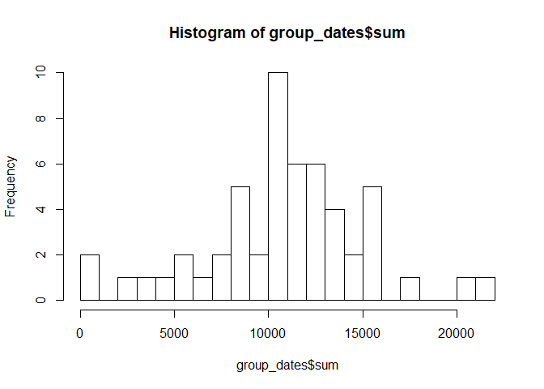
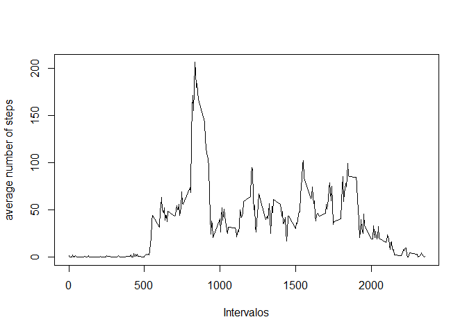
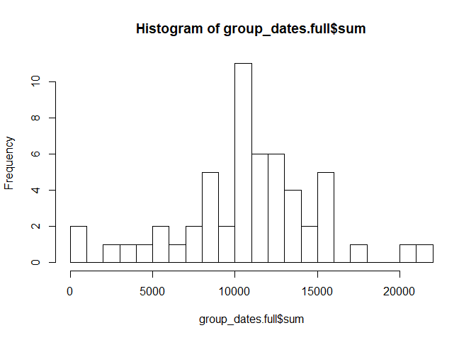
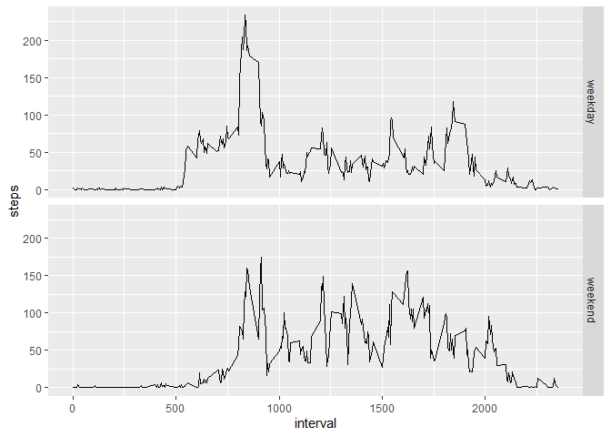

```r
library(ggplot2)
library(dplyr)
```

```
## Warning: package 'dplyr' was built under R version 3.6.3
```

```
## 
## Attaching package: 'dplyr'
```

```
## The following objects are masked from 'package:stats':
## 
##     filter, lag
```

```
## The following objects are masked from 'package:base':
## 
##     intersect, setdiff, setequal, union
```

## Loading and preprocessing the data

```r
data<-read.csv("activity.csv")
data$date <- as.Date(data$date)
```

## What is mean total number of steps taken per day?

```r
group_dates <- data %>%group_by(date) %>%  summarize(sum = sum(steps))
hist(group_dates$sum, breaks=20)
```

<!-- -->

Calculate the Mean and Median Values

```r
mean(group_dates$sum, na.rm=TRUE)
```

```
## [1] 10766.19
```

```r
median(group_dates$sum, na.rm=TRUE)
```

```
## [1] 10765
```

## What is the average daily activity pattern?

```r
group_int <- data %>%group_by(interval) %>%  summarize(mean = mean(steps, na.rm = TRUE))
plot(x=group_int$interval, y=group_int$mean, type='l',xlab="Intervalos", ylab="average number of steps")
```

<!-- -->
Get interval with max average

```r
group_int[group_int$mean==max(group_int$mean),]$interval
```

```
## [1] 835
```

## Imputing missing values
Rows with missing values

```r
nrow(data[!complete.cases(data),])
```

```
## [1] 2304
```
Filling NAs with the mean per interval

```r
data_full <- data
data_full$steps <- ifelse(is.na(data_full$steps),group_int$mean[group_int$interval == data_full$interval],data_full$steps)
group_dates.full <- data_full %>%group_by(date) %>%  summarize(sum = sum(steps))
hist(group_dates.full$sum, breaks=20)
```

<!-- -->

```r
mean(group_dates.full$sum, na.rm=TRUE)
```

```
## [1] 10766.19
```

```r
median(group_dates.full$sum, na.rm=TRUE)
```

```
## [1] 10765.59
```
There is no significant difference aftering inputing the missing values.


## Are there differences in activity patterns between weekdays and weekends?

```r
data_full$day <- 'weekday'
data_full$day[weekdays(data_full$date) %in% c("Saturday", "Sunday")] <- "weekend"
data_full$day <- as.factor(data_full$day)
x <- aggregate(steps ~ interval + day, data_full, mean)
p <- ggplot(x, aes(interval, steps)) + geom_line()
p + facet_grid(rows = vars(day))
```

<!-- -->

There are some differences between the activity paterns during the weekdays and weekends. 


